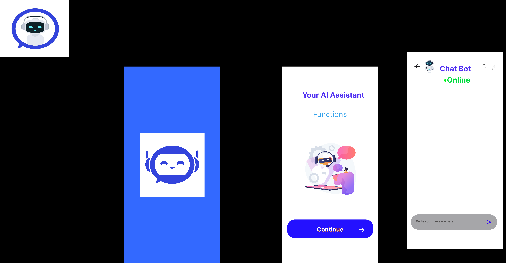

<p align="center">
  
</p>

<h1 align="center">🤖 AI-Powered Customer Support Chatbot (POC)</h1>

<p align="center">
This proof of concept demonstrates a complete AI-powered customer support chatbot backend using the Godspeed framework with OpenAI integration, Redis for session management, and WebSocket support.
</p>
---

##  Project Structure

```
src/
├── datasources/
│   ├── redis.yaml              # Redis configuration
│   └── openai.yaml             # OpenAI API configuration
├── events/
│   └── chat/
│       ├── message.yaml        # Handle incoming messages
│       ├── history.yaml        # Get conversation history
│       └── escalate.yaml       # Escalation logic
│   └── health.yaml             # Health check endpoint
├── functions/
│   ├── ai/
│   │   ├── openai-client.ts
│   │   ├── intent-classifier.ts
│   │   └── response-generator.ts
│   ├── chat/
│   │   ├── session-manager.ts
│   │   ├── escalation-logic.ts
│   │   └── conversation-handler.ts
│   └── utils/
│       ├── logger.ts
│       └── analytics.ts
└── config/
    └── default.yaml
```

---

##  Key Features

###  Core Chat Flow
- Real-time messaging via **WebSocket**
- AI-powered responses using **OpenAI GPT**
- Redis-based **session persistence**
- Chat logs stored for **tracking & analytics**

###  Intent Classification
Detects query types such as:
- Account/Login Issues
- Billing Queries
- Product Support
- General Questions
- Escalation Triggers

Uses:
- Keyword matching
- GPT-based classification

###  Escalation Logic
Triggers include:
- Negative sentiment (via sentiment analysis)
- Frustration keywords (e.g., “manager”, “agent”)
- Unresolved repeated attempts
- Explicit request for human support

---

##  Development Plan

###  Phase 1: Setup (Week 1)
- Initialize Godspeed project:
```bash
npx @godspeedsystems/cli create chatbot-poc
cd chatbot-poc
```
- Add dependencies:
```json
{
  "@godspeedsystems/core": "latest",
  "openai": "^4.0.0",
  "redis": "^4.6.0",
  "socket.io": "^4.7.0",
  "winston": "^3.10.0",
  "sentiment": "^5.0.2"
}
```
- Configure environment:
```yaml
server:
  port: 3000
datasources:
  redis:
    host: localhost
    port: 6379
    db: 0
  openai:
    apiKey: ${OPENAI_API_KEY}
    model: "gpt-3.5-turbo"
```

###  Phase 2: AI Integration (Week 2)
- Set up OpenAI client and prompts
- Implement intent classification (keywords + GPT)
- Generate hybrid responses (templates + AI)

###  Phase 3: Sessions & WebSocket (Week 3)
- Implement Redis session storage & TTL
- WebSocket message handling, reconnection, and error logic

###  Phase 4: Escalation & Analytics (Week 4)
- Define escalation logic (rules, sentiment, keywords)
- Log interactions and collect analytics

---

##  Sample Code

###  OpenAI Integration
```ts
import OpenAI from 'openai';

export class OpenAIClient {
  private client: OpenAI;

  constructor(apiKey: string) {
    this.client = new OpenAI({ apiKey });
  }

  async generateResponse(messages: any[], context: any) {
    const systemPrompt = \`You are a helpful customer support assistant.
    Current user context: \${JSON.stringify(context)}
    Rules:
    - Be concise and helpful
    - Suggest human support if unsure
    - Use a professional tone\`;

    const response = await this.client.chat.completions.create({
      model: "gpt-3.5-turbo",
      messages: [
        { role: "system", content: systemPrompt },
        ...messages
      ],
      max_tokens: 150,
      temperature: 0.7
    });

    return response.choices[0].message.content;
  }
}
```

###  Escalation Logic
```ts
export class EscalationManager {
  shouldEscalate(conversation: any, userMessage: string): boolean {
    const sentiment = this.analyzeSentiment(userMessage);
    if (sentiment.score < -0.5) return true;

    const keywords = ['manager', 'supervisor', 'human', 'agent'];
    if (keywords.some(k => userMessage.toLowerCase().includes(k))) return true;

    if (conversation.messageCount > 10 && !conversation.resolved) return true;

    return false;
  }
}
```

---

##  POC Success Criteria

###  Functional Goals
- [ ] Respond to 5+ customer query types
- [ ] Store & recall session history
- [ ] Handle 3+ escalation trigger types
- [ ] Real-time messaging via WebSocket
- [ ] Accurate Redis session persistence

###  Performance Benchmarks
-  Response time < 2 seconds
-  Handle 10+ concurrent chats
-  Successful escalation < 30 seconds
-  95%+ uptime during testing

---

## Testing Strategy

###  Unit Tests
- AI response logic
- Intent classification
- Escalation rules
- Redis session I/O

###  Integration Tests
- Full conversation lifecycle
- WebSocket + Redis + OpenAI flow

###  Load Testing
- Concurrent sessions
- Redis stress test
- WebSocket load

---

##  Deployment Strategy

###  Dockerization
- Container-based deployment
- Health checks and live probes

###  Security
- Input sanitization
- Secure WebSockets
- API rate limiting
- Redis auth

---
